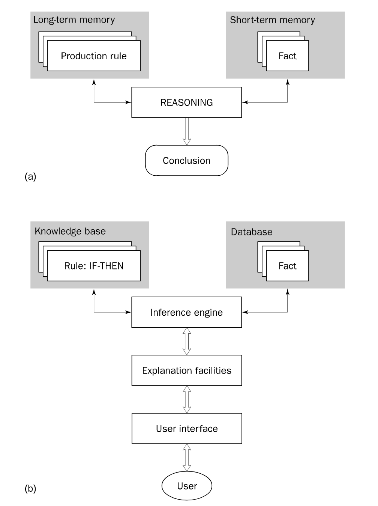

# Expert System Practicum

Dit is een uitwerking van een practicum van het vak Intelligent Systems op de Hogeschool van Amsterdam. Het gebruik ter inspiratie is geheel op eigen risico.

# Introductie

Voor het implementeren van het expert systeem ben ik gebonden aan de mogelijkheden van deze java shell. In deze shell kan ik meerdere antecendenten (condities) toevoegen en als er 5 antecedenten zijn praten we over 5 AND condities. Deze shell doet niet aan OR. Veel mensen gebruiken PROLOG voor het expert systeem waarbij ik voor de verandering voor een java expert systeem wilde kiezen. Ik zal kijken in hoeverre het mogelijk is om een familieboom in deze shell te maken.

Deze shell biedt zowel forward chaining als backward chaining. Forward chaining houdt in dat het langzamerhand van A naar B gaat maar bij backward chaining is het juist andersom waarbij het B als doel stelt en langzaam terugwerkt van B naar A. Dit blijkt in de praktijk iets efficiënter te werken.

Voor dit practicum zijn een aantal vragen gesteld. Deze vragen lijken gebaseerd te zijn op het gebruik van PROLOG maar ik zal ze zo goed mogelijk proberen te beantwoorden met behulp van deze expert shell.

## Vraag - en antwoord

---

Maak een voorbeeld systeem met je eigen "familieboom" als data en regels over vader, moeder, oom, neef/nicht (cousin en nephew) en laat het systeem vragen beantwoorden als "wie zijn (klein-)zonenbeschrijf/test hoe het werkt. Let op dat je geen feiten toevoegd die het systeem zelf af kan leiden dus hou de initiële kennisbank zo klein mogelijk.

Er is een methode dat gebruik maakt van de RuleInferenceEngine klasse dat wordt gebruikt om regels aan feiten te koppelen. In deze methode worden er regels aan de database toegevoegd. 

    RuleInferenceEngine rie=new KieRuleInferenceEngine();
    rule=new Rule("Uncle");
    rule.addAntecedent(new EqualsClause("hasSibling", "yes"));
    rule.addAntecedent(new EqualsClause("hasNibling", "yes"));
    rule.setConsequent(new EqualsClause("relation", "Uncle/Aunt"));
    rie.addRule(rule);

Daarna wordt er een andere functie aangemaakt die gebruik maakt van de inference engine, daar wordt een variabele met de inference engine als datatype. De returnwaarde van de RuleInferenceEngine methode (de returnwaarde is de engine met database) wordt gegeven aan dit variabelen. In de tweede methode met de variabele worden 'facts' toegevoegd.

    RuleInferenceEngine rie=getInferenceEngineFamilyTree();
    rie.addFact(new EqualsClause("gender", "female"));
    rie.addFact(new EqualsClause("hasParent", "yes"));
    rie.addFact(new EqualsClause("hasSibling", "yes"));
    rie.addFact(new EqualsClause("hasNibling", "yes"));

Het vreemde van deze expert shell is dat het maar tot 1 resultaat kan komen. Oftewel, je krijgt resultaat op één match, ofwel de laatste match. Dat is ook wel logisch maar in het geval van een familieboom zou je wel verder moeten kijken dan dat en meer naar het globale plaatje. Het is niet direct een IF THEN gebaseerd systeem wat het een beetje vaag maakt en lastig om een familieboom expert systeem van te maken. Ik zal relatie namen gebruiken voor de familieboom in plaats van namen in verband met privacy gevoel en het feit dat het niet direct kan in deze shell. Gezien de limitaties is het doel om de relatie te weten gegeven een paar feiten. 

Stel dat je de volgende twee feiten hebt: **isVrouwelijk** en **heeftBroerZus**. Op basis van die feiten zou je de relatie eruit halen.

    public static void doInferBC()
        {
            RuleInferenceEngine rie=getInferenceEngineFamilyTree();
            rie.addFact(new EqualsClause("gender", "female"));
            rie.addFact(new EqualsClause("hasSibling", "yes"));
    
            System.out.println("Infer: family relation");
    
            Vector<Clause> unproved_conditions= new Vector<Clause>();
    
            Clause conclusion=rie.infer("relation", unproved_conditions);
    
            System.out.println("Conclusion: "+conclusion);
        }

Hier worden de feiten toegevoegd aan de engine en wordt het **infer** proces gestart. De output is als volgt:

    Infer: family relation
    Conclusion: relation = Sister

Op basis van deze twee feiten weten we dat het om een **zus** gaat. Als je hier nu meerdere feiten aan toevoegt zal het resultaat hetzelfde blijven omdat er al een match is.

Alle regels betreffende familierelaties zijn als volgt:

    Rule rule=new Rule("Father");
    rule.addAntecedent(new EqualsClause("hasChildren", "yes"));
    rule.addAntecedent(new EqualsClause("gender", "male"));
    rule.setConsequent(new EqualsClause("relation", "Father"));
    rie.addRule(rule);
    
    rule=new Rule("Mother");
    rule.addAntecedent(new EqualsClause("hasChildren", "yes"));
    rule.addAntecedent(new EqualsClause("gender", "female"));
    rule.setConsequent(new EqualsClause("relation", "Mother"));
    rie.addRule(rule);
    
    rule=new Rule("Daughter");
    rule.addAntecedent(new EqualsClause("gender", "female"));
    rule.addAntecedent(new EqualsClause("hasParent", "yes"));
    rule.setConsequent(new EqualsClause("relation", "daughter"));
    rie.addRule(rule);
    
    rule=new Rule("Son");
    rule.addAntecedent(new EqualsClause("gender", "male"));
    rule.addAntecedent(new EqualsClause("hasParent", "yes"));
    rule.setConsequent(new EqualsClause("relation", "son"));
    rie.addRule(rule);
    
    rule=new Rule("Brother");
    rule.addAntecedent(new EqualsClause("hasSibling", "yes"));
    rule.addAntecedent(new EqualsClause("gender", "male"));
    rule.setConsequent(new EqualsClause("relation", "Brother"));
    rie.addRule(rule);
    
    rule=new Rule("Sister");
    rule.addAntecedent(new EqualsClause("hasSibling", "yes"));
    rule.addAntecedent(new EqualsClause("gender", "female"));
    rule.setConsequent(new EqualsClause("relation", "Sister"));
    rie.addRule(rule);
    
    
    rule=new Rule("Uncle");
    rule.addAntecedent(new EqualsClause("hasSibling", "yes"));
    rule.addAntecedent(new EqualsClause("hasNibling", "yes"));
    rule.setConsequent(new EqualsClause("relation", "Uncle/Aunt"));
    rie.addRule(rule);
    
    rule=new Rule("Nibling");
    rule.addAntecedent(new EqualsClause("hasUncleAndOrAunt", "yes"));
    rule.setConsequent(new EqualsClause("relation", "Nibling"));
    rie.addRule(rule);

Kijkend naar bovenstaande code moet je als voorwaarde om oom te zijn een broer of zus hebben en dan nog een **nibling** hebben. **Nibling** is een Engels combinatiewoord van niece en nephew dus als je een database hebt met deze twee feiten dan kan geïnfereert worden dat het om een oom gaat. Er zijn regels gemaakt voor de volgende relaties:

- Moeder
- Vader
- Dochter
- Zoon
- Broer
- Zus
- Oom
- Nichtje/Neefje

Beschrijf ook hoe je dit systeem 'futureproof' maakt voor eenoudergezinnen, M/V/X genderneutraal of geslachtswijzigingen en huwelijk tussen personen van hetzelfde geslacht. Als huwelijk tussen 3 personen ook al mag - kan het systeem dat aan?

Het feit dat een kind ouders heeft check ik met **hasParent** en niet met **hasMother** of **hasFather**. Het is daar geschikt voor eenouder gezinnen alleen zou het feit dat een eenouder of meerouder gezin is niet te achterhalen zijn. Ik heb mijn systeem nu op basis van relaties maar als ik echte personen had was dat wel een tekortkoming. Het is ook genderneutraal want iedereen heeft een gender ook al heb je het veranderd of niet. In het expert systeem kan je gewoon invullen welk gender je wilt. Change my mind. Een huwelijk tussen 3 personen is wat ingewikkelder. Je hebt twee personen die met elkaar getrouwd zijn. Je kan aangeven dat de moeder getrouwd is met de vader maar hoe geef je een derde persoon aan. Moet de moeder getrouwd zijn met een ander persoon of de vader. In de expert shell die ik gebruik lijkt het niet oplosbaar maar met een heleboel IF THEN statements zal het misschien wel lukken. Maar compatibiliteit met meer situaties vergt meer werk aan de ontwikkeling van het systeem, maar dat is niet werkbaar in dit systeem.

Laat zien hoe/of het systeem Forward chaining en Backward chaining toepast en of nieuwe afgeleide feiten permanent of tijdelijk worden opgeslagen. 

De shell ondersteunt zowel forward als backward chaining. Volgens the AI theorie (het boek) zijn er twee soorten expert systemen. Een production based systeem en een basis structuur expert systeem. Aangezien dit systeem direct met een conclusie komt en niet laat zien hoe die daar op komt lijkt het een production based system. Het heeft namelijk geen **explanation facilities** die ervoor zorgen dat de stappen uitgelegd worden. Het heeft ook geen user interface wat de basis structuur dus wel heeft. Een eigenschap van een production based systeem is dat er sprake is van een short term memory en een long term memory. In de short term memory staan de feiten en in de long term memory staan de productieregels. Gezien deze termen en het feit dat long term niet perse permanent is kunnen we ervan uitgaan dat nieuwe afgeleide feiten tijdelijk worden opgeslagen. Naast dit wordt er naast een uitwerking in de output nergens een code uitgevoerd dat het ergens definitief opslaat, het zit allemaal in de RAM.  

(a) production system model (b) basic structore of a rule-based expert system

In het figuur hierboven is het beter te zien. De inference engine wordt bij het production-based systeem **reasoning** genoemd terwijl de shell de term **inference engine** gebruikt. Het gaat dus niet direct uit van de definitie van het boek. De feiten worden bovendien opgeslagen in een WorkingMemory class wat al RAM aanduidt:

    protected WorkingMemory memory = new WorkingMemory();
    this.memory.addFact(antecedent);

Zoals eerder gezegd beschikt de shell over forward - en backward chaining. Ik zal beide methodes nu uitvoeren.

### Forward chaining

We hebben de volgende methode:

    public static void doInferFC()
        {
            RuleInferenceEngine rie=getInferenceEngineFamilyTree();
            rie.addFact(new EqualsClause("gender", "female"));
            rie.addFact(new EqualsClause("hasSibling", "yes"));
    
            System.out.println("before inference");
            System.out.println(rie.getFacts());
            System.out.println();
    
            rie.infer(); //forward chain
    
            System.out.println("after inference");
            System.out.println(rie.getFacts());
            System.out.println();
        }

De regels worden in **rie** gedaan en aan **rie** worden nog een paar feiten toegevoegd die gematcht kunnen worden op regels. De output is als volgt wanneer we deze methode uitvoeren:

    before inference
    [gender = female, hasSibling = yes]
    
    after inference
    [gender = female, hasSibling = yes, relation = Sister]

Before inference heb je alleen de initieel toegevoegde facts maar op het moet dat je **rie.infer()** oproept en nog een keer de feiten ophaald met **rie.getFacts** zie je bij after inference dat er nog een feit afgeleid is op basis van de regels. Wat als we het over een vrouw hebben en die ook nog een broer of zus heeft weet je gelijk dat het om een zus gaat. Nu gaan we kijken wat er gebeurd als we nog een feit toevoegen:

    rie.addFact(new EqualsClause("hasParent", "yes"));

De output is als volgt wanneer de forward chaining gestart wordt:

    before inference
    [gender = female, hasSibling = yes, hasParent = yes]
    
    after inference
    [gender = female, hasSibling = yes, hasParent = yes, relation = daughter, relation = Sister]

Nu zie je bij de initiële feiten ook **hasParent** staan en dat je de **infer()** methode aanroept zie je dat er twee relaties bij zijn gekomen.  Namelijk **dochter** en **zus**. Voor dochter was **hasParent** en **gender** de oorzaak en voor zus was **gender** en **hasSibling** de oorzaak. Dus hij laat alle relaties zien die matchen op feiten. Bij forward chaining gebeurt het volgende bij deze feiten:

Rule: gender & hasSibling → relation (sister)

Rule: gender & hasParent → relation (daughter)

Forward chaining begint met de bekende data en gaat daar verder mee. Er wordt hierdoor gezegd dat forward chaining **data-driven** is.  

Op het moment dat we forward chaining doen gebeurt het volgende:

    public List<Rule> match() {
            List<Rule> cs = new ArrayList();
            Iterator var2 = this.rules.iterator();
    
            while(var2.hasNext()) {
                Rule rule = (Rule)var2.next();
                if (rule.isTriggered(this.memory)) {
                    cs.add(rule);
                }
            }
    
            return cs;
        }

De hele lijst met gegels wordt afgegaan en er wordt telkens gekeken of het match met een rule in de working memory waar de feiten opgeslagen zijn.

Nu gaan we kijken naar backward chaining.

### Backward chaining

Backward chaining noemen ze **goal-driven** omdat het expert systeem uit gaat van een doel en de inference engine probeert dan te bewijzen dat het doel haalbaar is. We kijken nu naar de output van de backward chaining van ons expert systeem:

    public static void doInferBC()
        {
            RuleInferenceEngine rie=getInferenceEngineFamilyTree();
            rie.addFact(new EqualsClause("gender", "female"));
            rie.addFact(new EqualsClause("hasSibling", "yes"));
    
            System.out.println("Infer: family relation");
    
            Vector<Clause> unproved_conditions= new Vector<Clause>();
    
            Clause conclusion=rie.infer("relation", unproved_conditions);
    
            System.out.println("Conclusion: "+conclusion);
        }

De bovenstaande code wordt uitgevoerd, je kan zien dat een vector wordt aangemaakt en deze wordt meegegeven aan de **infer** methode. Doordat dit gebeurt wordt er een andere code branch uitgevoerd dan de infer methode die we oproepte voor de forward chaining. De output is als volgt:

    Infer: family relation
    Conclusion: relation = Sister

Op basis van de beschikbare feiten krijg je direct resultaat. Het resultaat is hier dat het om een zus gaat. Laten we nog een feit toevoegen:

    rie.addFact(new EqualsClause("hasParent", "yes"));

De output is nu als volgt:

    Infer: family relation
    Conclusion: relation = daughter

De relatie is nu dochter, omdat het de laatste match is. Een probleem is wanneer ik de rule in de code omwissel, zodat de zus regel eerder dan de dochterregel toevoeg dat ik dan zus als output krijg. Het klopt niet echt dat de output ligt aan de sequentie van regels wat de betrouwbaarheid van het expert systeem in twijfel trekt. Zoals eerder vermeld is er dus een probleem dat het de laatste match laat zien. Maar is dit nu ook goal-driven, oftwel doet het backward chaining zoals beschreven in de theorie. Wat backward chaining ten eerste instantie doet is kijken of het doel bereikt is. Laten we naar de backward chaining infer methode kijken:

    public Clause infer(String goalVariable, List<Clause> unproved_conditions) {
            Clause conclusion = null;
            Iterator var4 = this.rules.iterator();
    
            while(var4.hasNext()) {
                Rule rule = (Rule)var4.next();
                rule.firstAntecedent();
                boolean goalReached = true;
    
                while(rule.hasNextAntecedent()) {
                    Clause antecedent = rule.nextAntecedent();
                    if (!this.memory.isFact(antecedent)) {
                        if (this.memory.isNotFact(antecedent)) {
                            goalReached = false;
                            break;
                        }
    
                        if (!this.isFact(antecedent, unproved_conditions)) {
                            goalReached = false;
                            break;
                        }
    
                        this.memory.addFact(antecedent);
                    }
                }

Als parameter wordt een String meegegeven met de goal waar de backward chaining naar toe moet werken, alleen wordt deze goal om de 1 of andere reden nooit gebruikt in de code. Als ik in de goelVariable telkens een andere waarde geeft krijg ik nog steeds hetzelfde resultaat dus is het een redundante parameter die eigenlijk wel nodig is voor backward chaining. Het lijkt in principe het zelfde te doen als forward chaining maar dan op een andere manier, dat is de relatie tussen forward - en backward chaining eigenlijk ook. Het bepaalt de volgorde van executie. Ik zie alleen helaas geen overeenkomst met volwaardige backward chaining dus deze shell is helaas ver van volwaardig en is niet aangeraden voor productie gebruik. 

Zoek ook of de gebruikte inference engine of expert system shell in gebruik is (geweest) in de praktijk en waar.

Ik heb deze expert shell van deze [github](https://github.com/cschen1205/java-expert-system-shell) repo. Deze heeft in haar totaliteit 4 stars en 0 issues die aangemaakt zijn. Ik heb naar de profielen gekeken van diegenen die en sterretje geplaatst hebben en gezocht naar expert systeem repo's. Ik kwam [deze](https://github.com/RMPR/maintenancier) en [deze](https://github.com/chen0040/cs-expert-system-shell) tegen. De eerste link ging om een expert systeem bedoeld voor de diagnostiek van een computer. De tweede link was gewoon dezelfde shell maar vertaald in C#. Ik focuste me dus op de eerste repo. Wat me in eerste instantie op viel is dat er PROLOG bestanden aanwezig waren in de repo waarbij ik er van uit ging dat de ontwikkelaar de logica in eerste instantie in PROLOG had geschreven en daarna in een expert shell wilde implementeren. Hij heeft een **[Engine.java](http://engine.java)** bestand die die ergens anders in een **[Main.java](http://main.java)** aanroept. Hij heeft een visueele interface waar random vragen worden gesteld en de gebruiker beantwoord. Het antwoord wordt dan als regel toegevoegd aan het expert systeem. Dus in plaats van dat een expert regels toevoegt doet de eindgebruiker dat, maar in dit geval kan de eindgebruiker ook een expert zijn die een controle doet met een expert systeem. Op basis van de vragen wordt het probleem geconstateerd. De repo is in het Frans dus heel duidelijk is het niet maar zo ziet de structuur eruit. 

# Conclusie

De originele opdracht was om een familie boomstam te maken alleen dat bleek al snel niet mogelijk. Ik heb na bespreking met de docent zoveel mogelijk uitleg gegeven over de expert shell en hoe die tot haar antwoorden komt. Ik heb de relatieregels besproken en de forward- en backward chaining methodes. Ik ben ook nagegaan waar deze shell eerder is gebruikt.